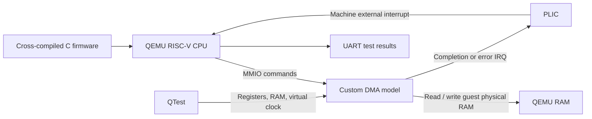

# virtual-soc-dma

A software-only virtual platform for developing and testing a DMA driver before hardware exists.

**Status: all planned milestones complete. The full suite and demo pass in a fresh Linux arm64 container and hosted Linux x86-64 CI. See [validation evidence](docs/validation.md) for the tested environment and CI status.**

## What this project does

Run a real cross-compiled RISC-V firmware binary inside QEMU. The firmware programs a custom memory-mapped DMA device, waits for its interrupt, and verifies the copied data. The device is a software model that can also simulate a stalled transfer or a missing interrupt, so the driver can be tested against failures.

Example: firmware requests a 1 KiB copy, continues a small CPU task while the device is busy, receives completion, and checks the destination. Another run deliberately stalls the DMA; the driver reaches its deadline, resets the device, and proves that a subsequent transfer works.

## Project scope

| Component | Decision |
| --- | --- |
| CPU/platform | QEMU RISC-V `virt`, one RV32 hart, TCG, M-mode bare metal, 128 MiB RAM, PLIC interrupts |
| New hardware model | One DMA channel; contiguous RAM-to-RAM copies of 1–65,536 bytes |
| Device interface | 32-bit MMIO registers, asynchronous completion, level-triggered IRQ, abort and reset |
| Guest software | C driver, startup/trap assembly, linker script, UART test firmware; no OS |
| Validation | QTest device contract tests and end-to-end firmware tests |
| Failure controls | Host-side options for stalled completion and dropped IRQ |
| Deliverable | Reproducible build, automated suite, text demo, traces, and documented contract |

The DMA model and QEMU integration will use **C**, following QEMU's native device interfaces. Firmware uses C with minimal RISC-V assembly. Python orchestrates builds/tests and validates logs.

## Architecture



Two different binaries are built: the host-native QEMU executable containing the device model, and a RISC-V `firmware.elf` executed by the emulated CPU. The firmware does not call the host model directly; all interaction crosses the guest MMIO/interrupt interface.

QEMU is an external, pinned dependency. Store our device sources, integration patches, firmware, and tests in this repository. Do not vendor the whole QEMU tree. QEMU `v10.0.0` is pinned to commit `7c949c53e936aa3a658d84ab53bae5cadaa5d59c`.

Integration: add an opt-in DMA option to the existing `virt` board, reserve its MMIO region and PLIC source, and include its node in the generated device tree. Preserve default `virt` behavior when the option is disabled. A stock QEMU binary will not contain this custom device.

## What we build and what we reuse

**Build:** device/register contract, DMA state machine, QEMU adapter and board patch, firmware driver, interrupt handling, recovery logic, tests, and trace collection.

**Reuse:** CPU instruction execution, RAM, UART, timer, PLIC, ELF loading, and QEMU's device/test infrastructure. The SoC name refers to this assembled virtual platform; this is not a model of a specific commercial chip.

## Completion criteria

1. A clean Linux environment builds the pinned QEMU integration and RISC-V firmware using documented commands.
2. The firmware boots and reports DMA detection over UART.
3. Polling and interrupt paths copy data correctly, preserve guard bytes, and support repeated transfers.
4. Invalid ranges/lengths/overlap produce defined errors without changing destination memory.
5. A stalled transfer and a dropped interrupt both produce bounded driver timeouts, followed by reset and a successful transfer.
6. Abort/reset before completion prevent stale memory writes and late interrupts.
7. Device tests and firmware tests run automatically with nonzero exit status on failure; CI preserves useful traces.

## Project boundaries

CPU/ISA implementation, RTL, FPGA deployment, SystemC co-simulation, Linux/kernel drivers, multicore, caches/coherency, IOMMU, PCIe, scatter-gather, multiple DMA channels, GUI, and bus arbitration modeling.

The completion delay is a configurable virtual-time scheduling aid. It does **not** model real bandwidth, cache behavior, bus contention, or chip performance. The model makes the whole copy visible at its completion event; partial transfer visibility is outside this project. CPU work during a pending transfer demonstrates asynchronous interaction, not a speedup claim.

## Documents

- [Device specification](docs/device-spec.md): the shared contract for model, driver, and tests.
- [Implementation plan](docs/implementation-plan.md): milestones, dependency order, and acceptance gates.
- [Completion checklist](docs/completion.md): each requirement mapped to code and tests.
- [Demo](docs/demo.md): commands and observed firmware output.

## Build and test

From the repository root, with Docker running:

```sh
./scripts/test-in-container.sh
```

This builds the development image, copies only project sources into a fresh Linux container, fetches and builds pinned QEMU, compiles eight RV32 firmware images, and runs the full suite plus the concise firmware demo. It copies logs and `summary.json` into `artifacts/` and removes its temporary container. No FPGA, host RISC-V toolchain, or host bind mount is needed. The first run needs network access and several minutes to compile QEMU. The Docker route was tested on an Apple Silicon Mac; the build/test processes run on Linux arm64.

Inside the development image or a Linux environment with the dependencies from `Dockerfile` installed:

```sh
./scripts/build-firmware.sh
./scripts/build-qemu.sh
python3 scripts/run-tests.py
python3 scripts/run-tests.py --scenario lifecycle
./scripts/run-demo.sh
```

To run the short demo directly from macOS/Linux with Docker:

```sh
make demo
# equivalent: ./scripts/run-demo.sh --docker
```

`make test` runs the clean full suite and demo. Inside an already built Linux environment, `./scripts/run-demo.sh` only runs the six demonstration firmware scenarios, without verbose native QTest output.

For incremental work, these commands reuse `build/`. `--stage boot`, `--stage detect`, `--stage polling`, and `--stage irq` restrict the firmware scenarios. Run the default full suite before publishing changes.

Host-only device options:

```text
-M virt,dma=on,aia=none -cpu rv32 -smp 1 -m 128M
-global virtual-dma.delay-ns=1000000
-global virtual-dma.stall-next=on
-global virtual-dma.drop-irq-next=on
```

The model is instantiated by the patched board, not a standalone `-device` command. Unsupported DMA platform configurations are rejected. VM migration/snapshots are outside this project and the device explicitly blocks migration.

## Debugging

Each firmware scenario writes UART output to `artifacts/<scenario>/stdout.log`, QEMU diagnostics to `stderr.log`, and DMA events to `model.trace`. Device tests have their own `qtest/` logs. The platform test checks the generated DTB against the address/interrupt contract. A host watchdog treats hangs as failures.

To inspect firmware in a debugger, add `-S -gdb tcp::1234` to the scenario command recorded in `artifacts/summary.json`, then connect a RISC-V-capable GDB and load its ELF symbols. Omit the test runner watchdog for an interactive debugging session.

## License

Firmware, scripts, shared register headers, and documentation use the MIT license. QEMU device code, native QTest code, and integration patches use GPL-2.0-or-later. See [LICENSE](LICENSE) and [GPL text](LICENSES/GPL-2.0.txt). QEMU retains its own upstream licensing.

## References

- [QEMU RISC-V virt platform](https://www.qemu.org/docs/master/system/riscv/virt.html)
- [QEMU QTest framework](https://www.qemu.org/docs/master/devel/testing/qtest.html)
- [Pinned QEMU board source](https://github.com/qemu/qemu/blob/v10.0.0/hw/riscv/virt.c)

These describe the reused platform and test framework. The custom DMA behavior is defined by this project's specification.
